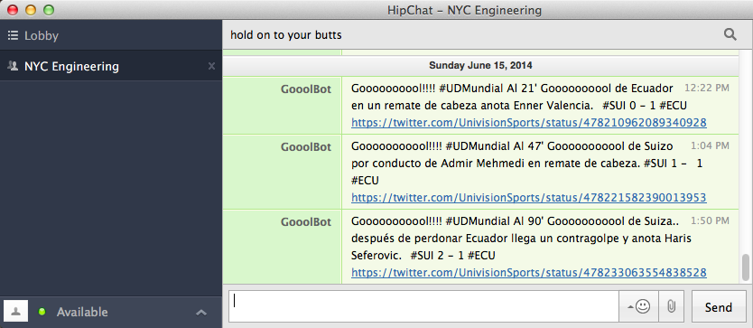

### gooolbot

relay goooooools to hipchat 

### description

the [univision world cup streams](http://futbol.univision.com/) 
seem to be on a thirty second delay.  the espn broadcasts are at least another
sixty seconds behind that. 

[@univisionsports](https://twitter.com/UnivisionSports), on the other hand, 
seems to be tweeting in faster-than-real-time.

this bot will notify you via [@hipchat](https://twitter.com/hipchat) that you should 
immediately command-tab to that browser window that you weren't doing a good job 
hiding from your boss anyway.

### requirements

- a twitter app and associated auth tokens - https://apps.twitter.com/
- a hipchat account with a personal api token - https://www.hipchat.com/account/api
- a hipchat room that you own with an auth token - https://www.hipchat.com/rooms

### setup

+ git clone https://github.com/jefforulez/gooolbot
+ cd ./gooolbot
+ npm install hipchatter twit config
+ cp config/sample.default.json config/default.json
+ vim config/default.json
+ node ./gooolbot.js

### revisions

+ 2014.06.15
	+ added sound support

### credits

written by  [@jefforulez](https://github.com/jefforulez)

thanks to

- https://github.com/charltoons/hipchatter
- https://github.com/ttezel/twit
- https://github.com/lorenwest/node-config

